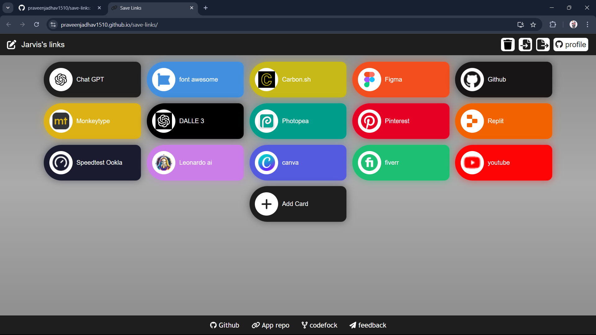
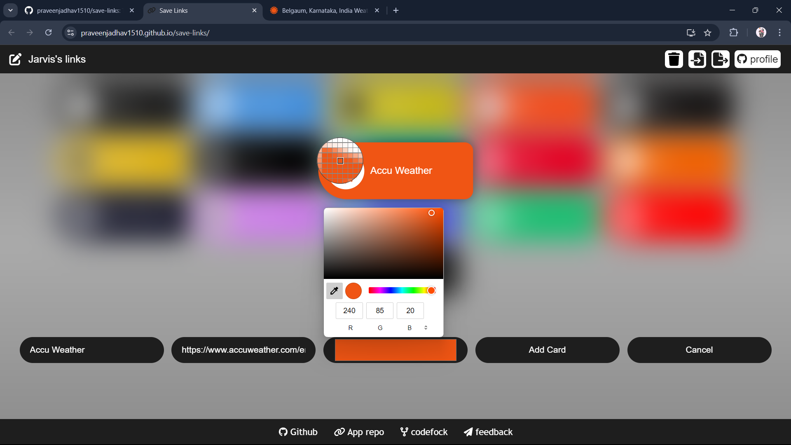
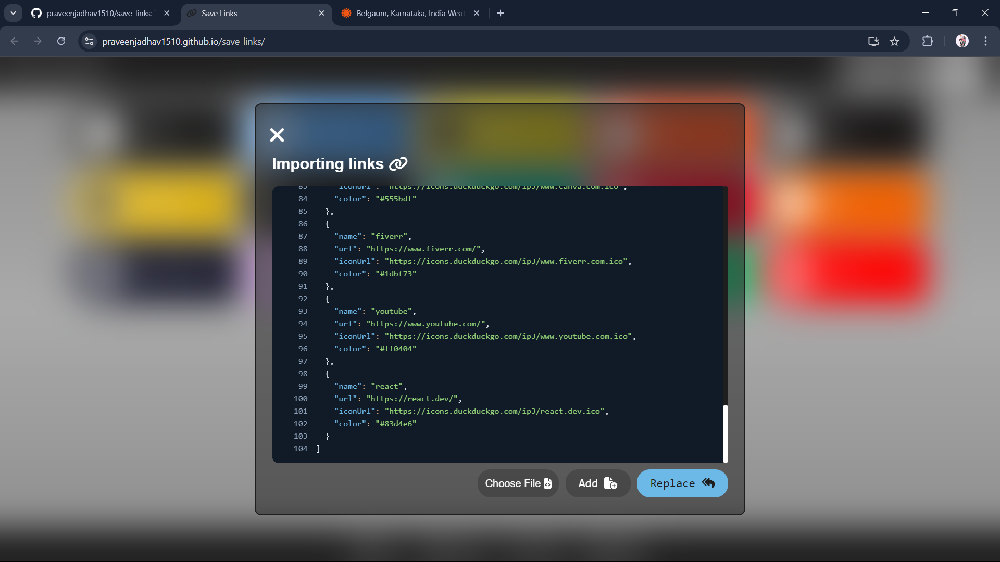
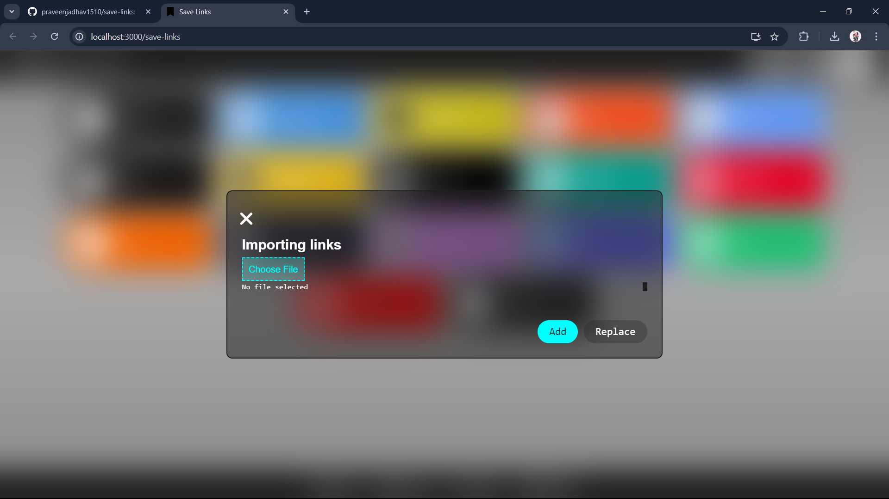

---

# Custom Link Cards

This project provides a sleek and interactive web interface for saving and managing favorite links in customizable cards. Users can personalize each card with custom text, URLs, and colors, making it easy to visually organize and access their links.

### Key Features:
- **Customizable Cards**: Users can add links with their own titles, URLs, and colors.
- **Automatic Favicon Loader**: The app automatically fetches the website’s favicon based on the URL provided, giving the cards a professional and polished look.
- **Visual Organization**: Cards allow for a visually appealing way to manage and organize frequently visited links.

### How to Use:
1. Click the **Add Card** button to create a new link card.
2. Input the desired **title** and **URL**.
3. Select a **color** for your card using the built-in color picker.
4. The app will automatically fetch the website’s favicon based on the provided URL.
5. Your saved links are now displayed as personalized cards for easy access.
6. You can export and import you links to any Device.

### Preview 1

### Preview 2 Adding card

### Preview 3 Exporting

### Preview 4 Importing

### Try it your self
#### App Url: https://praveenjadhav1510.github.io/save-links/
---
