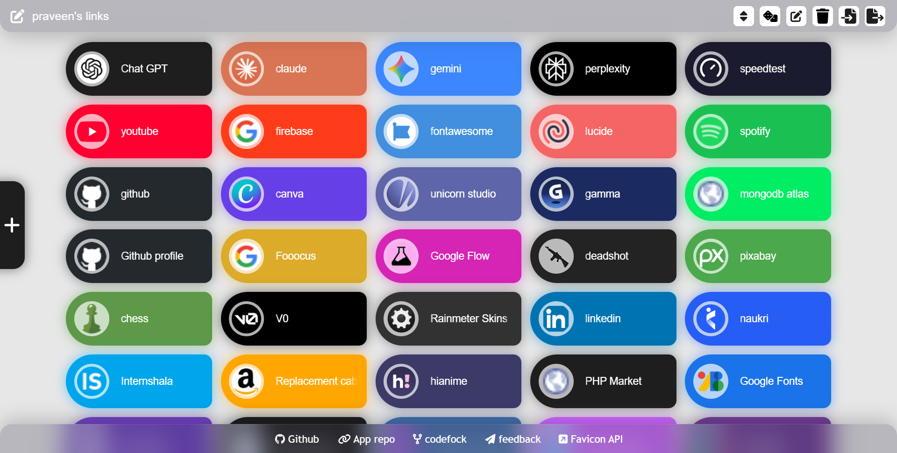
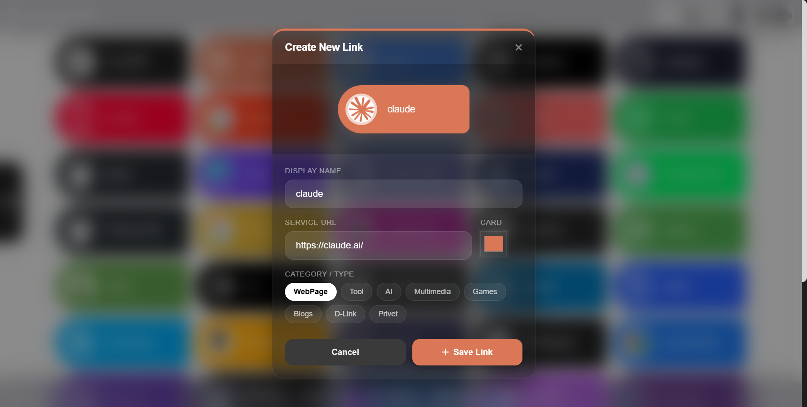
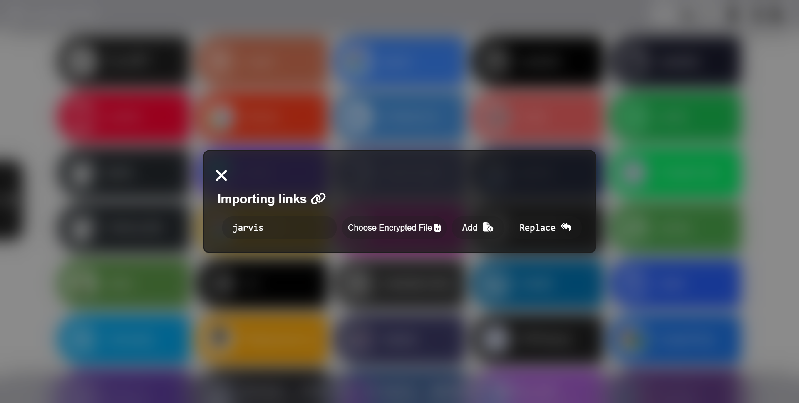
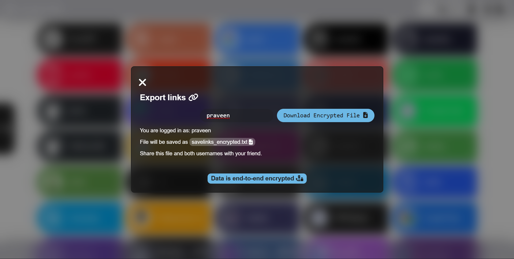

# SaveLinks - Your Ultimate Bookmark Manager

[](https://choosealicense.com/licenses/mit/)
[](https://reactjs.org/)
[](https://praveenjadhav1510.github.io/save-links)

**SaveLinks** is a premium, lightweight, and privacy-focused bookmark manager that allows you to organize your favorite URLs into a beautiful, interactive card-based interface. Built with React, it offers a seamless user experience without the need for accounts or database storage—everything stays in your browser.

---

## Key Features

- **Interactive Card UI**: Organize links into vibrant, customizable cards.
- **Smart Theming**: Pick custom colors for your cards to categorize them visually.
- **Auto-Favicon Fetching**: Automatically retrieves high-quality favicons for a professional look.
- **Drag & Drop Reordering**: Effortlessly arrange your links using smooth drag-and-drop interactions.
- **Encrypted Data Portability**: 
  - Export your collection as encrypted `.txt` files.
  - Secure sharing using a unique sender-receiver encryption key (powered by CryptoJS).
- **Advanced Filtering**: Quickly find links by category or title.
- **Fully Responsive**: Optimized for both desktop and mobile devices.
- **Glassmorphism Design**: Modern, sleek aesthetics with transparent layers and smooth transitions.

---

## Tech Stack

- **Frontend**: [React.js](https://reactjs.org/)
- **Drag & Drop**: [@dnd-kit](https://dnd-kit.com/)
- **Encryption**: [Crypto-JS](https://www.npmjs.com/package/crypto-js)
- **Icons**: [FontAwesome](https://fontawesome.com/)
- **Styling**: Vanilla CSS (Custom Glassmorphism Design)
- **Tooltips**: [react-tooltip](https://www.npmjs.com/package/react-tooltip)
- **Deployment**: [GitHub Pages](https://pages.github.com/)

---

## Screenshots

| Dashboard Overview | Adding a New Card |
| :---: | :---: |
|  |  |

| Secure Export | Encrypted Import |
| :---: | :---: |
|  |  |

---

## Getting Started

Follow these steps to run the project locally on your machine.

### Prerequisites
- Node.js (v14 or higher)
- npm or yarn

### Installation

1. **Clone the repository**
   ```bash
   git clone https://github.com/praveenjadhav1510/save-links.git
   ```

2. **Navigate to the project directory**
   ```bash
   cd save-links
   ```

3. **Install dependencies**
   ```bash
   npm install
   ```

4. **Start the development server**
   ```bash
   npm start
   ```
   The app will be available at `http://localhost:3000`.

---

## How to Use

1. **Add a Link**: Click the **Add Card** (+) button, enter the URL and title, and pick a color.
2. **Organize**: Use the **Sort** icon to filter by category or drag cards to reorder them.
3. **Edit/Delete**: Toggle **Edit Mode** or **Delete Mode** from the footer to manage your cards.
4. **Export/Import**: 
   - Use the **Export** button to create an encrypted backup.
   - Use the **Import** button to restore your links or add links shared by others.
5. **Set Identity**: Set your username in the user profile modal to enable personalized encryption.

---

## Contributing

Contributions are what make the open-source community such an amazing place to learn, inspire, and create. Any contributions you make are **greatly appreciated**.

1. Fork the Project
2. Create your Feature Branch (`git checkout -b feature/AmazingFeature`)
3. Commit your Changes (`git commit -m 'Add some AmazingFeature'`)
4. Push to the Branch (`git push origin feature/AmazingFeature`)
5. Open a Pull Request

---

## License

Distributed under the MIT License. See `LICENSE` for more information.

---

## Author

**Praveen Jadhav**
- GitHub: [@praveenjadhav1510](https://github.com/praveenjadhav1510)
- Live Project: [SaveLinks](https://praveenjadhav1510.github.io/save-links)

---
*Developed with ❤️ to make link management easier.*
